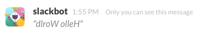
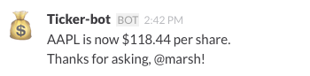
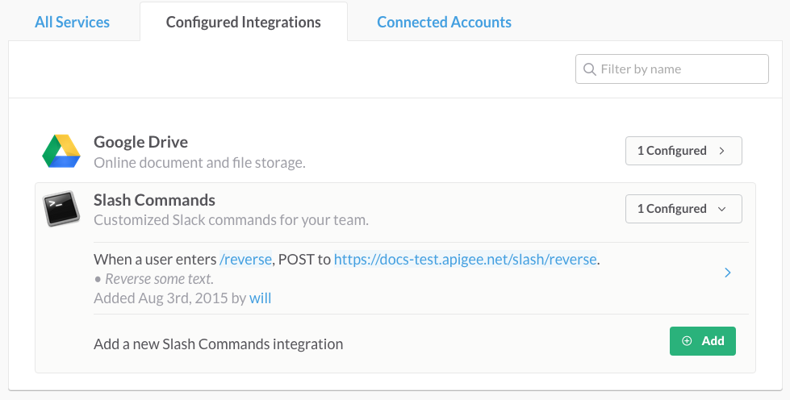
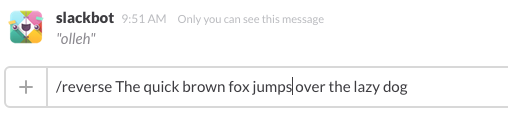
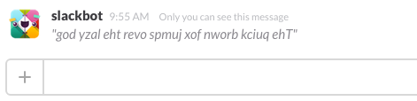

# Slack integration with swagger-node

[Slack](https://slack.com/) is a messaging app for team communication. A nice thing about Slack is that you can easily integrate external services to provide extra features. For example, out-of-the-box integrations are available for services like GitHub, Google Drive, Heroku, Jira, and many others. In this example, we'll show how easy it is to integrate a [swagger-node](https://www.npmjs.com/package/swagger) API with Slack. 

## Get the sample swagger-node app from GitHub

Download or clone the [swagger-node-slack](https://github.com/apigee-127/swagger-node-slack) project on GitHub. 

After downloading the app, do the following:

1. cd to the root project directory `swagger-node-slack`. 
2. Execute this command to get the Node.js dependencies:

    `npm install`


## About the sample swagger-node app

In this example, a `swagger-node` API implementation provides the back-end "services" that we will integrate into Slack. We created two sample API implementations for you to try out with Slack:

* An API that reverses whatever text you enter in a Slack conversation. Silly, but it works!

* An API that fetches a stock quote and prints it to a Slack team conversation. Yes, it's amazing!

In this short tutorial, we'll show you how to set up Slack integrations that call these `swagger-node` APIs.

### Before you begin

If you're going to try to do this tutorial, you'll need to do these steps first:

1. You need to either be a member of or create a new Slack team. Go to [slack.com](slack.com) for details. In either case, you need to have permission to create integrations.

2. Your app has to be reachable by Slack via HTTP, and it must be deployed to a platform that supports Node.js. We're going to deploy it to [Apigee Edge Cloud](http://apigee.com/about/products/api-management). To do that, you'll need to [sign up for an Apigee Account](https://accounts.apigee.com/accounts/sign_up). If you don't want to do that, you can deploy the app to any other Cloud platform that supports Node.js, like Heroku or AWS. However, we won't cover any other deployment options besides Apigee Edge in this topic.


## About the integrations

Here's a brief overview of the integrations we'll build here.

### Slash Command" integration (Text Reverser)

Slack "slash commands" let you execute a function by entering it directly in a Slack conversation. Here's how the Text Reverser integration we'll build here works. You'll enter it like this in Slack:

`/reverse Hello World`

And get a reply with the characters reversed:



### Incoming WebHook" integration (Ticker-bot)

Incoming WebHook integrations let you post data from an external source/service into Slack. For this example, we'll call a `swagger-node` API using a curl command. This API will then post a reply directly to a Slack channel. We'll call it like this...

`curl -X POST -H "Content-Type: application/x-www-form-urlencoded" http://docs-test.apigee.net/slash/ticker -d "text=AAPL`

...and get back a nicely formatted response in Slack, like this:



## Part 1: Building the Slash Command integration (Text Reverser)

Let's walk through the steps for integrating the "text reverser" API with Slack. We're not going to go overboard to explain how to set things up in Slack, but we'll give pointers to keep you on track. It's remarkably easy. 

### Quick peek under the hood

Take a look at the `swagger-node-slack` project. If you're not familiar with `swagger-node`, you can check out [the docs](https://github.com/swagger-api/swagger-node/blob/master/docs/introduction.md), and try the quick-start tutorial if you like. 

The key to understanding how the `swagger-node-slack` API works is to look at these two files:

* `./swagger-node-slack/api/swagger/swagger.yaml` -- This is the Swagger definition for the API. Note that it defines the paths, operations, and parameters for the API. Note that the `/reverse` path is associated with a controller file called `reverse` and an operation (a function in the controller file), also called `reverse`. 

    ```
    paths:
      /reverse:
        # binds a127 app logic to a route
        x-swagger-router-controller: reverse
        post:
          description: take text and reverses it
          # used as the method name of the controller
          operationId: reverse
    ```

* `./swagger-node-slack/api/controllers/*.js` -- In this example project, there are two controller files, one for the `/reverse` path and one for the `/ticker` path. As you can see, these files implement the actual operation logic for each path. Here's the `reverse()` function that gets executed when the `/reverse` path is called. 

   ```
   function reverse(req, res) {

      checkToken(req, res, function(err, reply) {
        if (err) {
            return res.json(err); 
        } else if (req.swagger.params.text.value === "") {
            res.json("Please enter some text to reverse!");
        } else {
            console.log(reply);
            var gnirts = req.swagger.params.text.value.split('').reverse().join('');
            res.json(gnirts);
        }
      });
   }
   ```


### Try it locally

You can run the `swagger-node-slack` project locally, and hit the API just to see what it does. 

1. cd to the `swagger-node-slack` directory on your system.
2. If you haven't done so previously, execute this command to update the Node.js dependencies: 

    `npm install`

2. Start the project:

    `swagger project start`

3. Open the file `./swagger-node-slack/controllers/reverse.js` in a text editor.

4. Note that the `token` var is set to `secret123`. The API requires a `token` parameter that matches this value, as we'll see. Later, we'll replace this value with a token issued by Slack.

    `var token = "secret123"`

3. In a separate terminal window, call the API as shown below. 

    `curl -X POST -H "Content-Type: application/x-www-form-urlencoded" http://localhost:10010/reverse -d "token=secret123&text=hello"`

    The API reverses the string specified by the `text` parameter and returns:

    `""olleh""`

    Note that the API also validates the token. If you call the API with a different token, you'll get an error. For example:

    `curl -X POST -H "Content-Type: application/x-www-form-urlencoded" http://localhost:10010/reverse -d token=secret234&text=hello"`

    `"Error: Sorry, the token key is invalid."`

### Create the Slack integration

Now, let's go over to the Slack side.

1. Log in to your Slack account. 

1. From your Slack team menu, choose **Configure Integrations**.

2. Scroll down to **DYI Integrations & Customizations** and click **Slash Commands**. 

3. In **Choose Commands**, enter the command name `/reverse`. 

4. **Click Add Slash Command Configuration**.

4. Fill out the integration settings:

    a. Command:  `/reverse`. 

    b. URL: http://{your apigee org name}-{the apigee environment name}.apigee.net/slack/reverse
    
    For example: http://docs-test.apigee.net/slack/reverse

    c. Method: POST

    d. Token: Copy the token; you'll need it shortly.

5. Click **Save Integration**. You'll see your integration in the **Configured Integrations** tab, as shown in this screen shot:



### Add the token to the controller file

1. Copy the token from the Slash command UI in Slack. 

>Note: When you enter the `/reverse` slash command in a Slack conversation, Slack sends a POST request to the `swagger-node` app with a bunch of parameters. One of them is the token. Code in `./swagger-node-slack/api/controllers/reverse.js` validates this token, ensuring that the command was sent from your Slack team. 

2. Open the file `./swagger-node-slack/controllers/reverse.js` in a text editor.

3. Enter the token string from Slack as the value of `var token`. For example:

    `var token = "6dIWuDTuheXsVVJcjDVVdA"` 

4. Save the file.

### Publish it

For this example, we'll publish the app to the [Apigee Edge](http://www.apigee.com) cloud platform. As mentioned previously, you'll need an Apigee account (it's free) to do this. (However, you can publish it to any platform that supports Node.js if you wish.)

1. Install [apigeetool](https://www.npmjs.com/package/apigeetool). This utility lets you deploy Node.js apps to Apigee Edge. 

    `npm -g apigeetool`

2. Make sure `apigeetool` is in your PATH. Just enter `apigeetool` at the command line. If you see a list of valid commands, you're good to go. 

    `apigeetool`

3. Be sure you're in the root directory of the `swagger-node` project:

    `cd swagger-node-slack`

4. Use `apigeetool` to deploy the app:

    `apigeetool deploynodeapp -u <your Apigee account email address> -o <your Apigee organization name> -e <An environment in your org> -n slash -d . -m app.js -b /slash -v default,secure`

    For example:

    `apigeetool deploynodeapp -u jdoe@apigee.com -o jdoe -e test -n 'slash' -d . -m app.js -b /slash`

    For help on this command, enter `apigeetool deploynodeapp -h`.

### Test it

Now we can hit our API directly from a Slack! In your Slack team channel, enter the `/reverse` command with some text to reverse:

`/reverse The quick brown fox jumps over the lazy dog`



And Slack returns the letters in reverse:



### What happened?

The Slack Slash Command Integration called the `swagger-node-slack` app that was deployed on Apigee Edge. Slack retrieved the response and printed it to the chat window. 

## Part 2: Building the Incoming WebHooks integration (Ticker-bot)

The Ticker-bot is an API implemented in `swagger-node` and added to Slack as an Incoming WebHook integration. This type of integration is designed to fetch some external data and display it in Slack. In this case, we implemented a `swagger-node` API that takes a stock symbol and sends the stock price to Slack. 


### Create the Slack integration

Let's go over to the Slack side first.

1. Log in to your Slack account. 

1. From your Slack team menu, choose **Configure Integrations**.

2. Scroll down to **DYI Integrations & Customizations** and click **Incoming WebHooks**. 

3. In **Post to Channel**, select the channel to post the API response to. In other words, whenever someone calls the Ticker-bot, a stock price is posted to this channel for everyone to see. 

4. Click **Add Incoming WebHooks Integration**.

4. Review the setup instructions. 

5. Copy the Webhook URL.

6. In the name field, change the default name to "Ticker-bot".

7. Add an icon or emoji if you wish.

6. Open the file `swagger-node-slack/api/controllers/ticker.js` in a text editor.

7. Locate this variable and uncomment it:

    `var URL = "https://hooks.slack.com/services/https://hooks.slack.com/services/GET/SLACK URL";`

8. Replace the value of the URL variable with the Webhook URL. For example:

    `var URL = "https://hooks.slack.com/services/https://hooks.slack.com/services/X012434/BT3899/PSbPEfQybmoyqXM10ckdQoa";`

9. Save the file.

### Publish it

The deployment steps with `apigeetool` are the same as in the previous example.

1. Be sure you're in the root directory of the `swagger-node` project:

    `cd swagger-node-slack`

2. Use `apigeetool` to deploy the app:

    `apigeetool deploynodeapp -u <your Apigee account email address> -o <your Apigee organization name> -e <An environment in your org> -n slash -d . -m app.js -b /slash -v default,secure`

    For example:

    `apigeetool deploynodeapp -u jdoe@apigee.com -o jdoe -e test -n 'slash' -d . -m app.js -b /slash`

    For help on this command, enter `apigeetool deploynodeapp -h`.

### Test it

With an Incoming WebHooks integration, the idea is to send a message FROM another service INTO a slack channel. 

We've created the service as a `swagger-node` API and deployed it to Apigee Edge, so now we can call it, like this...

`curl -X POST -H "Content-Type: application/x-www-form-urlencoded" http://docs-test.apigee.net/slash/ticker -d "text=AAPL&user_name=marsh"`

...and get back a nicely formatted response, like this:


## Extra credit

For extra credit, try creating a Slack Slash command `/ticker` that calls the Ticker-bot API. The command will let users enter something like this in Slack to post a stock price:

`/ticker AAPL`

Be sure to add token validation to the API, as implemented in the `/reverse` example.


